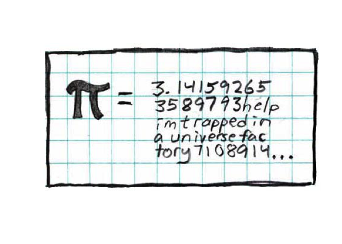
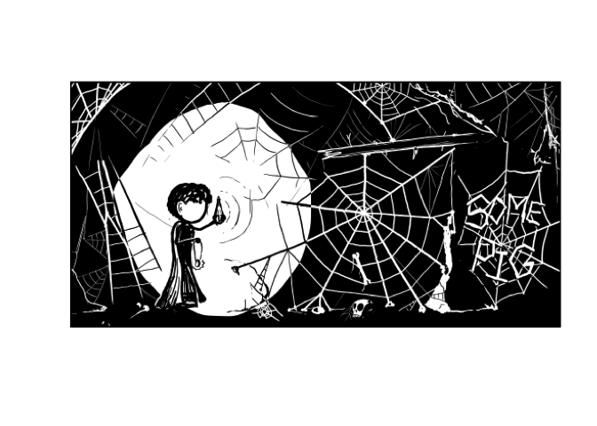
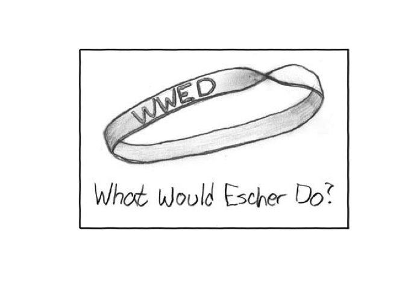

Comics - an R package
================

[](https://travis-ci.org/stillmatic/comics) [](https://codecov.io/gh/stillmatic/comics)

Motivation
----------

I'm bored, and you deserve a break from data science.

XKCD
----

You can plot a random XKCD into your plots window:

``` r
xkcd()
```

    ## Pi Equals: My most famous drawing, and one of the first I did for the site



If you don't want the alt-text, I won't judge either:

``` r
xkcd(print_alt = FALSE)
```



Or a specific one:

``` r
xkcd(88)
```

    ## Escher Bracelet: The only downside is that it would be a little uncomfortable


