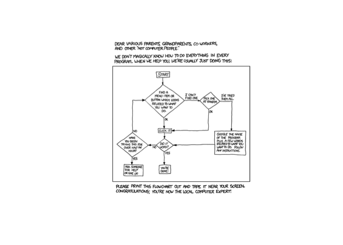
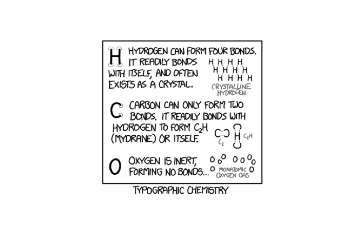
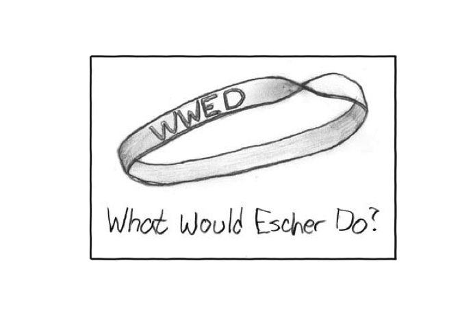

Comic Relief
================

Motivation
----------

I'm bored, and you deserve a break from data science.

XKCD
----

You can plot a random XKCD into your plots window:

``` r
xkcd()
```

    ## Tech Support Cheat Sheet: 'Hey Megan, it's your father. How do I print out a flowchart?'



If you don't want the alt-text, I won't judge either:

``` r
xkcd(print_alt = FALSE)
```



Or a specific one:

``` r
xkcd(88)
```

    ## Escher Bracelet: The only downside is that it would be a little uncomfortable


